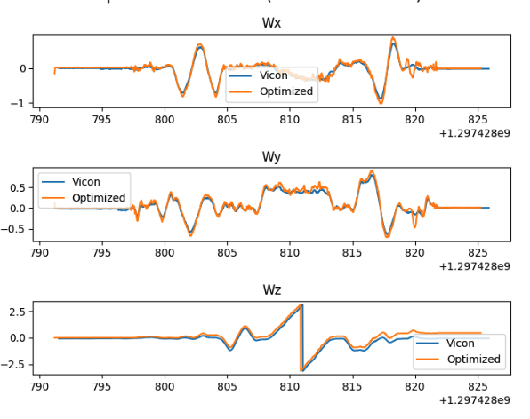
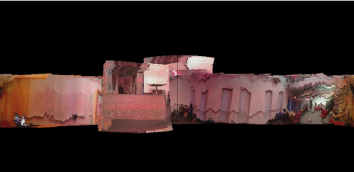

# Orientation Tracking
## Overview

This repository focuses on Orientation tracking based on IMU measurements with optimization 
of quaternions and gradient decent. It will go on to show how accurate these tracking 
estimates are by creating a panoramic image using images taken from the IMU body 
frame while rotating. The method discussed in this project can be adapted for 
environment mapping and live orientation estimations of a moving ridged body.

Check Project PDF for thorough explanation and results. 
## Features

    Orientation Estimation: Estimates the orientation of the body frame using utilizing values from the IMU.

    Panoramic construction: Creates a panoramic image from images taken in the IMU body frame while rotating by utilizing the orientation estimations.
## Sample Output

Vicon is actual orientation and optimized is the orientation estimated from IMU measurements.

Panoramic image constructed from images taken in the IMU body frame while rotating.

       
   
## Dependencies

    numpy

## Data 

    Data not included but shape description can be found in project pdf 

# Install dependencies:

     pip install -r requirements.txt

## Usage

    Data Preparation:
        Ensure your dataset is structured as described in the project report.

    Run the Code:
        Execute the main script: python main.ipynb.
        Adjust dataset selection and other parameters as needed within the script.

## Project Structure

    main.py: Main script to run the odometry estimation and panoramic image construction.

    Project1.pdf: Project documentation.
    ../data/: Directory containing datasets.
    

